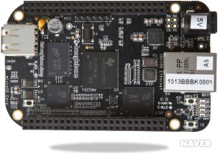

# 오픈 소스 하드웨어의 종류

### 1.아두이노

</img>

아두이노는 오픈 소스를 기반으로 한 단일 보드 마이크로컨트롤러로 완성 된 보드(상품)와 관련 개발 도구 및 환경을 말한다.
IDII(Interaction Design Institutelvera)에서 하드웨어에 익숙지 않은 학생들이 자신들의 디자인 작품을 손쉽게 제어할 수 있도록 하기 위해 탄생한 보드 제품으로 나오자마자 꾸준히 전 세계적인 인기를 끌고 있다.

#### 하드웨어적 특성

아두이노는 다수의 스위치나 센서로부터 값을 받아들여 LED나 모터와 같은 외부 전자 장치들을 통제함으로써 환경과 상호작용이 가능한 물건을 만들어 낼 수 있다.
또한 각종 센서/엑츄에이터 및 통신모듈 등을 탑재한 다양한 호환보드(‘쉴드’라 한다)들에 의해 쉽게 확장할 수 있는 점과 임베디드 시스템 개발 경험이 전혀 없는 사람들도 쉽게 접근하도록 펌웨어를 쉽게 만들어 탑재하도록 지원하는 통합개발환경(IDE)을 제공하는 점이 아두이노의 특징이다.

#### 소프트웨어적 특성

또한 이 점과 같이 어우러져 생기는 아두이노의 가장 큰 장점은 마이크로컨트롤러를 쉽게 동작시킬 수 있다는 것이다. 일반적으로 AVR 프로그래밍이 AVRStudio와 WinAVR(avr-gcc)의 결합으로 컴파일하거나 IAR E.W.나 코드비전(CodeVision)등으로 개발하여, 별도의 ISP 장치를 통해 업로드를 해야 하는 번거로운 과정을 거쳐야 하는 것에 비해 아두이노는 컴파일된 펌웨어를 USB를 통해 쉽게 업로드 할 수 있다. 또한 아두이노는 다른 모듈에 비해 가격이 30달러 정도로 비교적 저렴하고, 윈도를 비롯해 맥 OS X, 리눅스와 같은 여러 OS를 모두 지원한다. 또한 어도비 플래시, 프로세싱, Max/MSP와 같은 소프트웨어와 연동할 수 있습니다.
그리고 오픈소스 하드웨어인만큼 아두이노 보드의 회로도가 CCL에 따라 공개되어 있으므로, 누구나 직접 보드를 만들고 수정할 수 있다는 특징이 있다.

#### 현황

Atmel사의 AVR이라는 마이크로 컨트롤러를 적용한 첫 제품 이후로 100만 단위의 누적 판매대수를 오래전에 초과하며 ‘쉴드’라는 확장 보드, 다양한 변종 제품이 풍부해 뚜렷한 생태계를 형성하고 있으며, 아두이노가 인기를 끌면서 이를 비즈니스에 활용하는 기업들도 늘어나고 있다. 장난감 회사 레고는 자사의 로봇 장난감과 아두이노를 활용한 로봇 교육 프로그램을 학생과 성인을 대상으로 북미 지역에서 운영하고 있고 자동차회사 포드는 아두이노를 이용해 차량용 하드웨어와 소프트웨어를 만들어 차량과 상호작용을 할 수 있는 오픈XC라는 프로그램을 선보이기도 했다.

### 2. 라스베리 파이(Raspberry Pi)

</img>

라스베리 파이(Raspberry Pi)는 영국의 라즈베리파이 재단이 학교에서의 기초 컴퓨터 과학 교육용 프로젝트의 목적으로 개발된 초소형/초저가 PC이다. 아두이노와 달리 키보드, 마우스, 모니터만 연결하면 PC가 될 수 있는, 즉 일반 데스크톱과 유사하다는 것이 강조되는 제품이다.
리눅스 OS를 기반으로 하며 세부적인 설정을 제공함으로써 초보 프로그래머에 맞춤형 환경을 제공하고 2012년 4월 20일 A 모델과 B 모델의 회로도가 라즈베리 파이 재단에 의해 공개된 오픈 소스 하드웨어이다. 

#### 하드웨어적 특성

라즈베리 파이는 처음 판매된 B 모델과 나중에 나올 모델 A가 있는데, 모델 A는 한개의 USB 포트와 이더넷 콘트롤러가 없고 모델 B보다 저렴하다. 모델 B는 2개의 USB포트와 10/100 이더넷 컨트롤러가 장착되어 있다.

모델 A는 RJ45 이더넷 포트가 없으나, 사용자가 추가한 USB 이더넷이나 와이파이 어댑터로 네트워킹이 가능하다. 사실 컨트롤러가 없는 A 모델과 컨트롤러가 달린 B 모델간의 큰 차이는 없는데, 그 이유는 B모델의 컨트롤러는 내장 USB 이더넷 컨트롤러이기 때문이다. 그리고 현재 다른 컴퓨터와 같이 일반적인 USB 키보드와 마우스는 라즈베리 파이와 호환된다.

또한 라즈베리 파이는 실시간 시계가 없어, 운영 체제는 네트워크 타임 프로토콜을 사용하거나, 아니면 부팅할 때마다 사용자가 시간을 다 적어줘야 한다. 혹은, 배터리 백업되는 실시간 시계(DS1307)을 I2C 인터페이스로 추가할 수 있다.

#### 소프트웨어적 특성

위에 서술했다시피 라즈베리 파이는 리눅스 커널 기반 운영 체제를 사용하며, Raspbian이라는 라즈베리 파이에 최적화된 데비안 계열의 자유 운영 체제가 현재로서는 가장 권장되는 시스템이며, 이는 2012년 7월에 출시되었다.

GPU는 펌웨어 이미지를 통해 접근이 가능하며, 이 이미지는 SD 카드로부터 부팅할 때 GPU에 로드된다. 이 펌웨어 이미지는 바이너리 블롭으로도 알려져 있는데, 리눅스용 드라이버는 공개되지 않은 사유 소프트웨어이다. 응용 소프트웨어를 사용하게 되면, 비공개 실시간 라이브러리를 호출하게 되고, 이는 다시 리눅스 내의 오픈 소스 드라이버를 호출하게 되는데,  제공되는 커널 드라이버의 API가 이런 비공개 라이브러리를 지원하기 위해 특화되어 있다. 비디오 응용 프로그램은 OpenMAX를 사용하며, 3D 그래픽은 OpenGL ES를 사용하고, 2D 응용 프로그램은 OpenVG를 사용한다. 

2012년 02월 19일, 라즈베리 파이 파운데이션은 초기 버전의 운영 체제 이미지를 SD카드에 담아 발표했다. 이 이미지는 데비안 6.0 (Squeeze)에 기초하며, LXDE 데스크탑 환경과, 미도리 브라우저, 그리고 수많은 프로그래밍 툴을 같이 포함하고 있다. 또한 이 이미지는 라즈베리 파이를 구동 시킬 수 있는 QEMU에서 실행 가능하므로, QEMU를 지원하는 많은 환경에서 실행시켜 볼 수 있다.

#### 현황

 현재 라즈베리 파이는 2006년에 개념이 형성되고 재단이 만들어져 2012년 처음 제품이 나온 이후 2013년 1월 초에 백만 대가 판매되는 등 세계적으로 활성화 되어있다.

### 3. 비글보드

</img>

비글보드는 라즈베리파이와 비슷한 배경에서 생겨난 오픈소스 하드웨어 플랫폼이다. 개발능력에 상관없이 쉽게 접근할 수 있는 환경을 제공하며 값싼 작은 컴퓨터에 원하는 주변기기를 붙여 초보 개발자를 포함한 누구나가 자신이 원하는 임베디드 시스템을 구성할 수 있도록 설계되어 교육용으로도 적합한 이 비글보드는 OMAP3530을 기반으로 하는 단일 기판 컴퓨터의 일종이다. 저전력 오픈 소스 하드웨어로 텍사스 인스트루먼트 (TI) 에서 디지키와의 제휴로 생산된다.

비글보드는 설계 부터 오픈 소스 소프트웨어 개발을 고려하였으며 잠재적인 고객이 TI OMAP 단일칩 시스템을 평가할 수 있는 기회도 제공하려는 목적도 가지고 있다.
교육용으로 전 세계 대학에서 오픈 소스 하드웨어와 오픈 소스 소프트웨어 역량을 키우기 위해 소규모 팀에서 개발되었다.
오픈 소스 하드웨어인만큼 일반 대중에 크리에이티브 커먼스 동일조건변경허락 면허로 제공된다.

