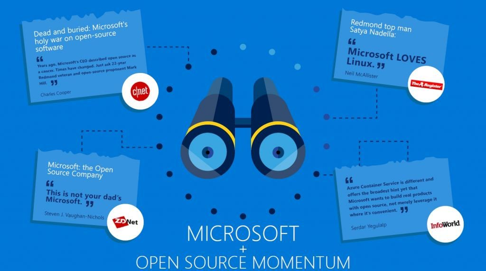

# 오픈소스의 장, 단점

</img>
>
## 장점

>
1. 비용절약부분
- 무료이며, 이는 프로젝트 크기가 크면 커질수록 극대화된다.
- 자금력이 약한 기업이라도 오픈 소스를 통해 개발진행을 용이하게 할 수 있다.

2. 편리함
- 특정 SW 및 HW의 종속성 탈피
- 오픈소스라면 다른OS로, 다른애플리케이션으로 자유롭게 갈아타기가 가능하다.
- 데이터의 관리와 통합이 유리해서, 필요에 따라서는 연관된 여러소프트웨어들을 패키지로 묶어서 배포하기도 한다.
- 업무에 필요한 방향으로 신속, 정확하게 어플리케이션을 개발해 적용할 수 있고 비즈니스 프로세스 개선과 리엔지니어링이 용이하다.

3. 호환성
- 오픈소스는 파일포맷도 오픈되어 있을 뿐만아니라 표준화 프로토콜을 활용하기 때문에 뛰어난 호환성을 자랑한다.

4. 안전성, 신뢰성
- 오픈소스는 검증된 이미지를 배포하므로 바이러스를 걱정 할 필요가 없다.
- 세계 수많은 개발자의 참여로 인한 빠른 발전 속도 및 높은 신뢰성 제공.
- 이를 통해 보안 문제와 데이터 센터의 통합, 현대화, 가상화에서도 우월하다.

5. 회사 브랜드 가치 제고

>
</img>

## 단점

>
</img>
>

>

1. 자유로운 개발에 따른 체계적이지 못한 문서

2. 무료인 OSS 사용에 따른 제품보증 및 유지보수의 어려움

3. OSS라이센스 미준수에 따른 저작권법 위반 및 특허소송의 위험성

4. 기존 유료 소프트웨어와의 호환성 우려 및 이에 따른 비숙련자의 사용에 대한 어려움

