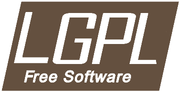
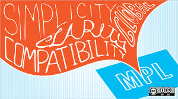

# 오픈 소스 라이선스

## 오픈소스 라이선스란?

</img>

위에서 많이 서술되었듯, 오픈 소스는 이미 우리의 삶 속으로 깊이 들어온 개념이며,정말 수많은 오픈 소스의 산물들이 주위에 존재한다. 그만큼 오픈 소스를 사용하는 사람들이 많아졌는데,이에 따라 오픈 소스에 대한 사람들의 의견이 나눠지기 시작했다. 어느 정도까지 공개할 것인가, 어떤 것을 수정했을 때에 그 것의 권리는 누구에게 있는가 등등 다양한 의견들이 나오면서 이 문제를 해결할 기준의 필요성이 대두되었다. 그래서 나온 것이 바로 오픈 소스 라이선스다.

오픈 소스 라이선스란 오픈 소스 소프트웨어 개발자와 이용자 간의 사용방법 및 조건의 범위를 명시해놓은 계약이며, 각 소프트웨어마다 적용되는 라이선스가 다르다. 지금부터 그 라이선스의 종류를 소개하도록 하겠다.

### 1.GNU 일반 공중 사용 허가서(GPL)

</img>

GPL이란 자유 소프트웨어재단(FSF)에서 만든 오픈 소스 소프트웨어를 위한 라이선스이다.
GPL은 현재 가장 많은 오픈 소스 소프트웨어가 채택하고 있는 라이선스이다. 이 라이선스의 특징은 가장 강력한 공개를 요구한다는 것인데, 
GPL의 주요원칙들은 다음과 같다.

> 1. 컴퓨터 프로그램을 어떠한 목적으로든지 사용할 수 있다. 다만 법으로 제한하는 행위는 할 수 없다.
> 2. 컴퓨터 프로그램의 소스 코드를 용도에 따라 변경할 수 있다.(개작 가능)
> 3. 컴퓨터 프로그램의 실행 복사본은 언제나 프로그램의 소스 코드와 함께 판매하거나 소스코드를 무료로 배포해야 한다.(원본 배포 전염성)
> 4. 변경된 컴퓨터 프로그램 역시 프로그램의 소스 코드를 반드시 공개 배포해야 한다.(파생물 배포 전염성)
> 5. 변경된 컴퓨터 프로그램 역시 반드시 똑같은 라이선스를 취해야 한다. 즉 GPL 라이선스를 적용해야 한다.(파생물 라이선스 전염성)

1번과 2번 조항은 오픈 소스의 개념 그 자체이지만 3번 이후의 조항들은 ‘전염성’ 조항이라고도 불리며, 어떤 GPL 라이선스가 적용된 소프트웨어를 사용해서 생겨난 모든 복사본이나 다른 소프트웨어들도 자동으로 GPL 라이선스가 적용된다는 아주 무서운 성질을 포함하고 있다.
지금 현재 GPL 2.0 버전이 가장 많이 사용되고 있는 라이선스이며, GPL 3.0 버전에서는 심지어 하드웨어에 까지 전염성 조항을 적용하려고 해서 
많은 반발을 샀다.

-GPL 2.0 적용 사례 : 모질라 파이어폭스(v2.0), 리눅스 커널(v2.0), 깃(v2.0), 마리아DB(v2.0), 워드프레스(v2.0), 드루팔(v2.0)

### 2.LGPL(Lesser General Public License)

</img>

아무리 GPL이 현재 주된 라이선스라고는 하지만 저 전염성 조항의 강력한 제약이 마음에 들지 않는 사람들도 많았던 것은 사실이다. 그래서 자유 소프트웨어 재단의 강력한 철학이 담긴 GPL의 카피레프트 조항(전염성 조항)을 보완하기 위하여 만든 라이선스가 바로 LGPL이다.
LGPL은 원본 소프트웨어를 그대로 사용해서 만든 부산물을 공유할 의무는 사라졌지만 만약 원본 소프트웨어가 아닌 그 소프트웨어를 수정했을 때에 생긴 부산물들은 GPL과 같은 전염성 조항들이 적용된다.
좋은 자유 소프트웨어 제품이 더 많이 사용될 수 있고 표준이 되도록 유도하기 위하여 단순한 라이브러리/모듈 링크를 허용한 라이선스로서, 원래는 원본 그대로의 라이브러리에만 적용하기 위한 의도로 ‘Library GPL’이라는 이름이였으나 모든 라이브러리에 적용된다는 오해를 사 ‘Lesser GPL’로 변경되었다. 

### 3. BSD (Berkeley Software Distribution)
 
</img>

버클리의 캘리포니아 대학에서 배포하는 공개 소프트웨어의 라이선스이다. BSD 라이선스의 경우에는 BSD 자체가 공공기관에서 만들어낸 것이므로 공공의 몫으로 돌려주자는 의미가 강하므로 라이선스 자체에는 아무런 제한 없이 누구나 자신의 용도로 사용할 수 있도록 만들어진 것으로 라이선스 및 저작권 표시 조건 외에 굉장히 자유로운 라이선스 중 하나이다.
 
-적용 사례 : Nginx(The BSD 2-Clause License)

### 4. MPL(Mozilla Public License)

</img>

모질라 공용 허가서(Mozilla Public License, MPL)는 과거 넷스케이프(Netscape) 브라우저의 소스코드를 공개하기 위해 개발된 라이선스이다.
MPL의 특징은 소스코드와 실행파일의 저작권을 분리함으로써 수정한 소스코드의 경우 MPL로 공개하고 원저작자에게 수정한 부분에 대해 알려야 하지만 실행파일은 독점 라이선스로 배포가 가능한 점이다. 즉, 사용한 MPL 소프트웨어와 수정한 MPL 소프트웨어에 대한 공개 의무만을 가지며 별도의 소스코드와 실행파일은 독점 라이선스를 가질 수 있다.