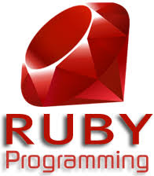
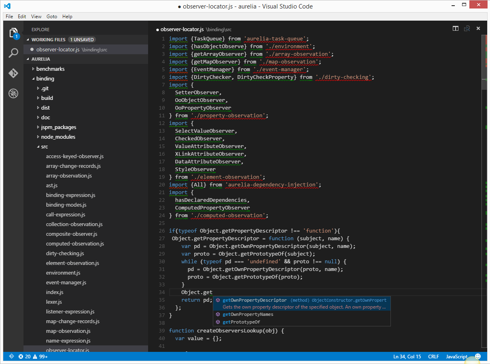

# 오픈소스 소프트웨어의 종류

## 1. 개발 언어
-------------------
### 1-1. Python

</img>

[소스코드 다운로드 링크](https://www.python.org/downloads/source/)

for offline - https://www.python.org/downloads/source/

Python은 1991년에 발표된 프로그래밍 언어이다. 몇몇 예외를 제외하면 대부분의 라이브러리를 오픈 소스로 지원한다. 다른 언어에 비하면 배우기 쉽고, 빠른 생산성과 다양한 라이브러리와 같은 장점에 주목하여 최근 많은 프로그램이 Python을 사용한다. 대표적으로 인스타그램이나 유튜브는 Python으로 구현되어 있다.

### 1-2. PHP

</img>

[소스코드 다운로드 링크](http://php.net/downloads.php)

for offline - http://php.net/downloads.php

PHP는 서버 사이드 스크립트 언어[1](#footnote_1) 중에 하나이다. C언어 문법에서 파생된 문법을 사용하여, 소규모 홈페이지 제작시 쉽고 빠르게 제작할 수 있다. 다만 협업이 힘들다는 문제가 있어 포털 사이트에서는 사용하는 경우를 찾기 힘들고, 개인 웹페이지 위주로 사용한다. Facebook은 PHP기반의 [Hack](https://github.com/facebook/hhvm/tree/master/hphp/hack)이라는 오픈소스 언어를 개발하여 사용한다.

[1] 서버 사이드라는 네트워크의 한 방식인 클라이언트-서버 구조의 서버 쪽에서 행해지는 처리과정 중 실행되는 스크립트 언어이며 대표적으로는 JavaScript가 있다.

### 1-3. Ruby

</img>

[소스코드 다운로드 링크](https://www.ruby-lang.org/ko/downloads/)

for offline - https://www.ruby-lang.org/ko/downloads/

Ruby는 일본의 마츠모토 유키히로라는 사람이 개발한 프로그래밍 언어이다. Ruby는 완전한 객체지향 언어이며, 문법이 쉽다는 장점이 있어 초보자도 쉽게 다룰 수 있다. 트위터나 미투데이가 Ruby로 개발된 대표적인 예시이며, GitHub도 Ruby를 사용한다.

### 1-4. Swift

</img>

[소스코드 다운로드 링크](https://swift.org/source-code/)

for offline - https://swift.org/source-code/

Swift는 Objective-C[2](#footnote_2)의 단점을 보완하기 위해 만들어진 언어로, 2015년 12월 4일 오픈소스로 공개되어졌다. Windows 플랫폼에서는 아직 지원하지 않으므로, 주로 Mac OS나 iOS앱을 개발하는데 쓰인다. 2014년에 나온 언어라서 아직 대중화되지는 않았으나, 애플에서의 적극 서포트로 차후에 더 많은 곳에서 보일 가능성이 높은 언어다.

[2] C언어에서 파생된 객체 지향 프로그래밍 언어

### 1-5. R

</img>

[소스코드 다운로드 링크](https://cran.r-project.org/sources.html)

for offline - https://cran.r-project.org/sources.html

R은 1993년에 GNU 라이센스를 채택하여 만들어진 언어다. R은 다양한 통계 패키지와 그래픽 관련 패키지가 존재하여 통계를 내는데에 최적화 되어있고, 다양한 그래프를 사용할 수 있다. 이를 통해 데이터 마이닝, 빅 데이터 프로세싱, 기계학습 등에 유용한 언어로서 R을 사용한다.

### 1-6. HTML

</img>

HTML은 Hyper Text Mark-up Language의 약자이며, 이름에서 보듯이 대표적인 마크업 언어이다. HTML의 소스는 인터넷에서 우클릭 후 소스 보기를 하면 볼 수 있다. 인터넷에서 쉽게 볼 수 있는 htm이나 html문서는 이 언어를 이용하여 작성되었다. 현재는 표준으로 HTML5가 나와서 웹 표준으로 사용되고 있다.

### 1-7. C#

</img>

[소스코드 다운로드 링크](https://opensource.microsoft.com/?keyword=C%23)

for offline - https://opensource.microsoft.com/?keyword=C%23

C#은 2000년도에 Microsoft가 개발한 객체 지향 프로그래밍 언어이다. C#은 .NET Framework를 필요로 하기에, Windows외에서 사용하려면 Xamarin이라는 프레임워크와 Mono라는 개발 툴이 필요하다. 현재 C#은 상당히 높은 점유율을 보유하고 있으며, 언어의 완성도가 높고, UI의 작업이 편리하다는 장점을 가지고 있다. 최근에 Microsoft의 친 오픈소스 정책이후 오픈소스로 전환된 언어이다.

## 2. 텍스트 에디터,IDE,컴파일러,git
--------------------
### 2-1. Emacs

</img>

[다운로드 링크](https://www.gnu.org/software/emacs/)

for offline - https://www.gnu.org/software/emacs/

[소스코드 다운로드 링크](https://github.com/emacs-mirror/emacs)

for offline - https://github.com/emacs-mirror/emacs

Emacs는 리처드 스톨먼이 만든 텍스트 에디터이다. 1970년대부터 GNU 프로젝트에서 관리하는 버전을 비롯하여, GNU의 특성상 수많은 버전들이 존재한다. Emacs는 수많은 기능을 제공하는데, 1000개 이상의 단축키와 수많은 매크로를 지원한다. 다만 커서 이동과 같은 환경 이동에서는 불편하고, ctrl alt shift를 많이 사용하는 단점 때문에 다른 에디터에 비해 많이 사용되지는 않는다.

### 2-2. Eclipse

</img>

[다운로드 링크](https://www.eclipse.org/downloads/)

for offline - https://www.eclipse.org/downloads/

[소스코드 다운로드 링크](https://git.eclipse.org/c/)

for offline - https://git.eclipse.org/c/

Eclipse는 자바를 기반으로 2001년 부터 제작되기 시작한 IDE(통합 개발 환경)이다. 초기에는 IBM의 소프트웨어 개발 툴이 될 예정이었으나, 제작 도중 오픈소스로 전환하였다. Eclipse는 운영 체제의 제한 없이 사용가능 한 프로그램이며, 기본적으로는 Java 개발 툴이나, 플러그인을 사용하면 C/C++을 비롯하여 수많은 언어의 개발을 담당할 수 있다.

### 2-3. Git

</img>

[다운로드 링크](https://git-scm.com/downloads)

for offline - https://git-scm.com/downloads

[소스코드 다운로드 링크](https://github.com/git/git)

for offline - https://github.com/git/git

Git은 리누스 토발즈가 개발한 분산형 버전 관리 프로그램이다. 토발즈가 리눅스 커널 관리를 위하여 제작하였으며, 속도가 매우 빠르다. 또한 소스 코드를 수정하다가 잘못될 수 있기 때문에 오픈 소스 시대에 최적화된 저장소라고 평가되고 있다. Git은 Microsoft나 Mozilla 재단, 트위터 등 수많은 프로그램이 사용하고 있으며, Git을 호스팅해주는 [GitHub](https://github.com/)는 현재 오픈소스의 중심지로서 자리잡고 있다.

### 2-4. vi(vim)

</img>
</img>

(우측 사진은 GUI 기반의 vi(vim)에디터인 givm 이다.)

[다운로드 링크](https://vim.sourceforge.io/download.php)

for offline - https://vim.sourceforge.io/download.php

[소스코드 다운로드 링크](https://github.com/vim/vim)

for offline - https://github.com/vim/vim

vi(vim)은 UNIX계열부터 사용되는 텍스트 에디터의 한 종류이다. Linux 기반 운영체제에서는 기본적으로 설치되어 있는 텍스트 에디터이기도하다. vi(vim)은 초보자가 사용하기 힘든 인터페이스를 가지고 있으나, 숙달되면 vi(vim)은 손동작 횟수가 줄어들기 때문에 다른 에디터에 비해서 빠른 속도로 작업할 수 있다는 장점을 가지고 있다. 또한 커스터마이징이 쉽고 오랫동안 사용된 에디터이기에 유용한 플러그인이 많이 존재한다.

### 2-5. gcc

</img>

[다운로드 링크](https://gcc.gnu.org/install/)

for offline - https://gcc.gnu.org/install/

[소스코드 다운로드 링크](https://github.com/gcc-mirror/gcc)

for offline - https://github.com/gcc-mirror/gcc

gcc는 GNU Compiler Collection의 약자이다. 이름대로 GNU 프로젝트에서 제작한 컴파일러이며, Linux등 오픈소스 플랫폼에서의 일반적인 컴파일러이다. gcc는 처음에는 C 컴파일러만을 지원했으나, 기능이 추가되며 다른 언어를 지원하게 되었다. 현재 지원하는 언어는 C,C++,Objective-C,Fortran,Java,Ada,Go 등이 있다.

### 2-6. vscode

</img>

[다운로드 링크](https://code.visualstudio.com/)

for offline - https://code.visualstudio.com/

[소스코드 다운로드 링크](https://github.com/Microsoft/vscode)

for offline - https://github.com/Microsoft/vscode

vscode는 Microsoft에서 만든 Visual Studio Code의 준말이다. 이는 GitHub에서 만든 텍스트 에디터인 Atom을 기반으로 만들어졌으며, Git연동을 지원한다. 다양한 언어를 지원하므로 범용 코드 에디터로서 유용하며, 다른 Visual Studio제품들이 Windows만 지원하는 것과 다르게 Linux와 Mac에서도 사용 가능한 에디터이다.

## 3. 웹브라우저(엔진)
------------------
### 3-1. Gecko

</img></img>

[소스코드 다운로드 링크](https://github.com/mozilla/gecko)

for offline - https://github.com/mozilla/gecko

Gecko는 Mozilla 재단에서 개발한 웹브라우저 엔진이다. 당시 넷스케이프를 갈아엎고 새로 엔진을 짜는 마일스톤 과정을 거쳤고, 그 이후에 모질라 애플리케이션 스위트라는 웹브라우저와 메일 클라이언트가 혼합된 버전이 탄생한다. 그러나 기능은 강력했지만 무겁다는 단점이 있었고, 여기서 웹브라우저 기능만 분리시킨 파이어폭스를 만들게 된다. 파이어폭스는 상당히 가볍고, 메모리 사용량이 다른 브라우저에 비해 상당히 낮기 때문에 탭을 100개 이상 사용해도 안정적으로 돌아가는 편이라는 장점이 있다.

### 3-2. Chromium

</img></img></img>

[소스코드 다운로드 링크](https://www.chromium.org/developers/how-tos/get-the-code)

for offline - https://www.chromium.org/developers/how-tos/get-the-code

Chromium은 구글 크롬의 오픈 소스이다. 상표 등록 등의 문제로 별도의 소스 코드로 공개를 한다. 엔진 자체는 블링크 렌더링 엔진을 사용한다. 구글 크롬이 가진 속도나 기능등의 강점을 이유로 Chromium기반 웹브라우저는 상당히 많은 개수가 있다. 상단의 Opera 브라우저를 시작으로 해서 세계적으로 많은 브라우저가 있다.

### 3-3. ChakraCore

[소스코드 다운로드 링크](https://github.com/Microsoft/ChakraCore)

for offline - https://github.com/Microsoft/ChakraCore

ChakraCore는 Microsoft Edge의 웹 브라우저 엔진이다. 현재 이 엔진은 오직 Edge에만 사용되고 있다. 2015년 12월 5일에 오픈 소스로 전환하였으며, 현재는 우분투에 ChakraCore를 옮기는작업을 시행중이다. ChakraCore를 기반으로 한 Edge는 웹표준인 HTML5를 가장 잘 준수하는 웹브라우저이고, IE에 비해 빠른 속도와 다양한 편의 기능의 추가가 장점으로 부각되고 있다.

## 4. 운영체제
-------------
### 4-1. Android
### 4-2. Ubuntu
### 4-3. FreeBSD

## 5. 기타
---------
### 5-1. 7zip
### 5-2. GIMP
### 5-3. LibreOffice
### 5-4. Facebook
### 5-5. MediaWiki
### 5-6. OpenTTD/OpenRCT2/freeciv
