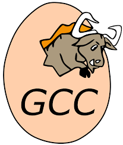

# 오픈소스의 의미

최근 오픈소스를 사용하거나 공유하는 기업체나 개인이 많아졌다. 이렇게 각광받는 오픈소스는 구체적으로 무엇인지 알아보도록 하자.

</img>

History of the OSI 자료에 따르면 그 어원이 1998년 2월 3일에 넷스케이프 브라우저의 원시코드에 대해 어떠한 형태로 공개해야 하는가에 대한 전략회의에서 
붙여졌다고 한다. 그리고 오픈소스의 [사전적정의](https://ko.wikipedia.org/wiki/%EC%98%A4%ED%94%88_%EC%86%8C%EC%8A%A4)는─소프트웨어 혹은 하드웨어 
제작자의 권리를 지키면서 원시 코드를 누구나 열람할 수 있도록 한 소프트웨어 혹은 오픈소스 라이선스에 준하는 모든 통칭을 일컫는다─이다. 

오픈소스는 오픈소스로 공개함으로써 기술의 공개라는 차원에서 그 가치가 생긴다. 개발자/개인이 자신의 필요에 따라 자유롭게 쓸 수 있기 때문에 
보다 많은 사람들이 그 소스를 발전시킬 가능성이 높아진다. 실제로 오픈소스로 공개해서 기대하는 효과 중 하나가 더 나은 소프트웨어 개발이기도 하다.

## 기업입장에서 오픈이란?

기업 입장에서 오픈 소스 솔루션 자체를 도입하는 것은 좋은 점, 나쁜 점 모두 있다. 당연히 새로 개발하지 않고, 어느 정도 검증된 솔루션을 쓸 수 있다는 
것은 장점이다. 하지만, 간과해서는 안되는 부분이 있다면 기술 회사를 지향하는 경우 오픈 소스를 도입하는 것과 더불어 자사의 기술 역량을 높이는 것을 
게을리 해서는 안 된다. 오픈 소스를 도입하는 것은 어려운 수학 문제를 푸는 데에 있어서, 답안지를 펴 놓고 하는 것과 비슷하기 때문이다. 
그러므로 기술을 오픈하는 쪽에게 너무 의존적으로 행동해서는 안 된다. 그 방법 중에 하나는 오픈 소스를 도입함과 동시에 자신도 오픈하는 것이다. 
회사 입장에서 ‘오픈’은 그 의미가 여러가지인데 타사에 대한 오픈임과 동시에 개인과 개인이 성과물을 오픈하는 것이다.

## 사내에서 갖는 의미

누군가 내 코드를 보고 거기에 대해서 평가한다고 생각하면, 프로그래밍에 임하는 자세가 분명히 다를 것이다. 많은 오픈 소스 코드들과 그동안 혼자 
프로그래밍했던 코드를 비교해보면, 프로그래밍의 기본 원칙부터 그 구조에 있어서 디자인 패턴의 적용 등 모든 부분에 있어서 뛰어나다.
예를 들어 오픈 소스의 버그를 고치고, 이것을 오픈 소스 커뮤니티에 알려주지 않고 자기 회사 내에서만 공유한다고 하자. 그렇다면 이 회사는 단기적으로 이 
오픈 소스를 사용하는 다른 제품에 비해 경쟁우위가 생겼을 지 몰라도, 오픈 소스 버전이 올라갈 때 마다 
수동으로 이 버그의 패치를 따로 해줘야 하면서 생기는 관리 비용이 생기기 때문에 절대 좋은 일이 아니게 될 것이다.

## 사외적으로 갖는 의미

자사가 만든 소스를 오픈하거나 또는 자사의 경험을 공유하게 되면 업계와 개발자 커뮤니티에서 주목을 받게 되고, 기술 리딩(leading)회사로서 입지를 다지게 
된다. 특히 국내의 경우에 이렇게 하는 회사가 많지 않아, 해외의 솔루션을 잘 이용한 경험을 공유 해도 단번에 주목 받는다. 이렇게 회사가 주목 받으면, 
그 회사가 내놓는 서비스나 제품도 초기에 주목 받기가 쉽다. 또 이렇게 기술을 리딩하는 회사로 포지셔닝을 하면 훌륭한 인재를 모으기도 쉬워 질 것이다.

## 오픈소스의 현황

현재 많은 기업체들이 오픈소스를 사용하고 있다. 2010년 7월부터 8월까지 2개월에 걸쳐 실시한 가트너의 연구 결과에 따르면 전 세계 11개 국가와 
547개의 IT기업 중 22%에 해당하는 기업이 업무환경 전체에 오픈소스 소프트웨어를 사용하는 것으로 나타났다. 또 부서와 프로젝트별로 오픈소스 
소프트웨어를 사용하는 기업은 전체의46%, 오픈소스 소프트웨어 도입에 앞서 장단점을 고려하고 있는 기업은 21%에 달했다.지금이 2017년인 것을 
감안하면 이는 더 늘어났을 것이다.

# 오픈소스 소프트웨어

## 오픈소스 소프트웨어란 무엇인가?

오픈 소스 소프트웨어란 오픈 소스가 적용된 소프트웨어, 즉 소스 코드가 공개(Open)된 프로그램이다. 대부분의 오픈 소스 소프트웨어는 무료로 사용 가능하기 때문에 프리웨어와 헷갈리는 경우가 많지만, 프리웨어는 무료로 사용 가능한 프로그램이고, 오픈 소스는 소스 코드가 공개된 프로그램이기 때문에 엄연히 다른 개념이다(예를 들어,오픈 소스 소프트웨어를 돈 받고 파는 경우도 있다). 자유 소프트웨어(Free Software)와 비슷하지만,오픈 소스 소프트웨어가 자유 소프트웨어보다 조금 더 상위 개념이다.

일반 사용자 입장에서는 프리웨어나 오픈 소스 소프트웨어나 단순히 공짜로 사용할 수 있다는 점에서는 비슷할 수 있지만, 소스코드를 보고 이해할 수 있고, 수정할 수 있는 개발자 입장에서는 크게 다르다. 예를 들어, 상용 또는 프리웨어 프로그램을 사용하는 사람들은 버그를 발견했다 하더라도 소스 코드를 모르니 수정할 수 없고, 사용자가 새로운 아이디어가 떠올랐다 해도 그것을 곧바로 프로그램에 적용시킬 수도 없다. 비교적 간단한 프로그램은 리버스 엔지니어링으로 어셈블러 수준에서 뜯어고칠 수는 있으나 코드가 공개된 것보다 몇 백 배는 어렵기도 하고, 저작권 같은 문제가 얽히고 설키기에 하려는 사람은 없다고 보면 된다.

하지만 사용자가 프로그래밍 언어를 아는 경우 소스가 공개되어 있다면 본인이 직접 소프트웨어의 문제를 수정하거나 개선을 할 수 있게 되는 것이다. 또한, 개발하던 프리웨어가 개인적인 사정이나 회사의 사정에 따라 개발이 중지되면 그대로 사장되는 경우가 종종 있는데, 오픈 소스 소프트웨어는 소스가 공개되어 있기 때문에 다른 개발자/개발사에서 이를 이어 받아서 새로이 개선해 나가면서 개발하는 것이 된다. 그래서 개발자와 사용자가 일치하는 개발 및 시스템,네트워크 분야에는 웬만한 클로즈드 소스 상용 소프트웨어는 명함도 못 내밀 정도로 고품질의 오픈 소스 소프트웨어가 넘쳐난다. 그러나 그러지 않는 분야에선 말 그대로 취미 수준에 머물러 있는 경우도 많다.

## 오픈소스 소프트웨어의 역사

### 1. 자유 소프트웨어 재단과 GNU 프로젝트
-----------------------------------

</img> </img>

1984년 리처드 스톨먼이 자유 소프트웨어 재단을 설립하고 , GNU 프로젝트를 시작하였다. 리처드 스톨먼은 소프트웨어는 무제한 공유되고 무료로 배포해야 한다는 주장을 하면서 재단을 설립하였다. 이 주장에 동의한 사람들이 자유 소프트웨어 재단과 GNU 프로젝트에 참가하게 되었고, 그 곳에는 텍스트 에디터 Emacs, 컴파일러 gcc 등을 비롯하여 수많은 프로그램을 제작하였다.

### 2. Linux
-----------

</img> </img>

1991년 리누스 토발즈는 미닉스를 개량하여 Linux 커널을 제작하였다.  이 Linux는 소스코드가 완전히 공개되어있는 대표적인 오픈 소스 소프트웨어이었기에, GNU 프로젝트에서 커널 개발이 지지부진 할 때에 Linux를 차용하여 GNU소프트웨어의 커널로 사용하게 되었다. 이 Linux는 독특한 방법으로 성장했는데, 이 당시에는 오픈 소스라고 할 지라도, 처음부터 공개하지 않고 어느정도 완성되어야 소스를 공개하였다. 그러나 리누스 토발즈는 처음부터 소스를 공개하였고, 버그 수정과 기능 추가에 대한 패치를 판단하여 받아들여지면 이 운영체제에 기여한 사람으로서 올라가게 하는 방식으로 사람들을 끌어모아 빠르게 발전하였고, 1994년에 1.0버전 이후로 IBM과 같은 대기업이 Linux를 지원하기 시작하였습니다.

### 3. 오픈 소스 소프트웨어의 성공과 현재
-----------------------------------

</img>

90년대 말 오픈소스 소프트웨어 기업인 레드햇의 성공 이후로 많은 회사들이 오픈 소스 소프트웨어 시장에 참여하기 시작했고, 현재는 많은 분야에서 오픈 소스를 사용하게 되었다. 이하는 현재 시장의 상황 중 몇가지 예시이다.

#### 3-1.  웹브라우저의 오픈소스 전환

  이 당시 넷스케이프 또한 모질라 재단 측에서 오픈소스로 전환하고 새롭게 브라우저를 만들어서 Gecko라는 엔진을 기반으로 한 파이어폭스를 시장에 선보이게 되었다. 파이어폭스는 당시 IE6에 비해 상당히 가볍고 빠른 브라우저로 IE6의 독주를 막아서는 역할을 하였다. 그 후 구글 크롬을 필두로 한 크로미움 프로젝트 기반 웹브라우저의 강세로 현재는 브라우저 사용률 3위에 머무르고 있으나, 현재의 웹브라우저 시장에서의 오픈소스가 주력이 되게 한 소프트웨어다.
#### 3-2. 다양한 분야에서 Linux의 사용

  또한 Linux도 지속적인 성장으로 다양한 분야에서 사용되고 있으며, 특히 모바일 시장에서는 Linux 기반 안드로이드가 압도적인 점유율을 보유하고 있다. 그 외에도 각종 서버용 운영체제로 Linux가 주로 쓰이고 있다.
#### 3-3. Microsoft에서의 오픈소스 전환

  한편 처음에는 오픈 소스 소프트웨어 진영과 대척점에 섰지만, 최근에 .NET을 오픈소스로 공개하기 시작했고 [기사](https://news.microsoft.com/2014/11/12/microsoft-takes-net-open-source-and-cross-platform-adds-new-development-capabilities-with-visual-studio-2015-net-2015-and-visual-studio-online) 그 후 C#을 오픈소스로 전환하였다. IE11과 Edge의 엔진인 차크라코어를 오픈 소스로 풀었다. 또한 Windows10 레드스톤에 우분투 기반 서브시스템, Bash 셸을 탑재하는 등, 오픈 소스 진영에 우호적으로 변하고, 적극적으로 활용하는 변화 양상을 보이고 있다.
  
#  오픈소스의 개발방식

오픈소스 소프트웨어 프로젝트에서는 ‘공개’라는 단어가 함축하듯이 여러명의 개발자가 참여하는 분산개발, 기존에 공개되어 있는 많은 소프트웨어 자원의 이용, 다양한 부류의 자원자들에 의한 소프트웨어 리뷰및 시험 과정, 기술 지원 방법, 기능의 확장,
새로운 프로젝트로의 따른 가지치기 과정 등이 상용 소프트웨어와 달리 매우 중요한 의미를 가지게 된다. 

새로운 프로젝트의 경우, 비교적 폐쇄적인 초기 개발 단계를 거쳐, 공개된 뒤에, 커뮤니티와 호흡 하는 오픈소스 소프트웨어 순환 구조에 들어간다. 일단 오픈소스 소프트웨어 순환구조에 들어가면, 프로젝트
관리자들뿐만 아니라 커뮤니티의 모든 참여자들이 공개된 소스에 접근 가능하며, 기능 추가, 버그 리포트 및수정, 새로운 기능의 요구 등을 함으로서 지속적인 소프트웨어의 개선이 그 안에서 이루어지게 된다.

</img>

## 개발방식 종류

### 1. 기존 프로젝트 참여하기

어떤 소프트웨어를 개발하고자 하는 사람(그룹)은 우선 개발하고자 하는 소프트웨어가 가져야할 기능에 대한 충분한 분석을 한 뒤, 이미 존재하는 오픈소스 소프트웨어 프로젝트들 가운데 주어진 요구 사항을 만족하는 것이 있는지 확인한다. 이 과정에서 요구사항을 모두 충족하는, 또는 충족을 목표로 하는 프로젝트를 성공적으로 발견했다면, 그 사람은 아마도 발견된 프로젝트의 사용자 또는 적극적인 역할을 하는 자원자, 더 나아가 개발자로 오픈 소스 소프트웨어 순환 구조에 참여하게 된다. 
혹시 부분적으로 요구 사항을 만족하는 프로젝트가 발견된 경우에도 기능추가를 요구하고, 그 요구가 프로젝트 관리자 그룹에서 받아들여짐으로서 순환 구조에 참여가 가능하다. 실제로 30% 가량의 개발자가 다른 개발자의 결과물을 개선하기 위해 기존 프로젝트 커뮤니티에 참여하는 것 으로 조사되고 있다. 

반면에, 상용 소프트웨어의 경우에는 주어진 요구사항을 만족하는 타 소프트웨어가 이미 시장에 존재하는 경우, 경쟁력(기능, 가격 등) 분석, 자사 관련 제품 라인업, 장기적 제품 로드맵 등을 바탕으로 한 경영적 판단을 거쳐 프로젝트의 진행 여부, 또는 해당소프트웨어 업체와의 연합, 더 나아가서는 인수, 합병등을 결정한다. 
검색 단계에서 유사 프로젝트가 발견되었지만, 기존 프로젝트 관리자 그룹에서 새로운 기능 추가 요청을 받아들이지 않은 경우에 개발자는 두가지의 선택을 할 수 있다. 첫번째는 검색단계에서 요구 사항을 만족하는 프로젝트가 없었던 경우와 같이, 전혀 새로운 프로젝트를 시작하는 것이고, 두 번째 선택은 직접 기존 프로젝트에 기능을 추가하는 방법이다. 

이를 프로젝트 가지치기 (Branching)라 하며, 공개소스 소프트웨어의 경우, 원 소스를 바탕으로 수정되거나, 추가된 소스 를 모두 공개한다면, 소스의 사용과 배포가 자유롭기 때문에 아무런 법률적 문제없이이런 결정을 내릴 수 있다. 이런 과정으로 개발된 결과는 원 소스에 대한 패치 형태로 원 소스의 개정에따라가는 형식으로 배포되거나, 원 소스의 특정 버전을 기점으로 하는 새로운 프로젝트로 발전하며, 독자적인 오픈 소스 소프트웨어 순환 구조를 성공적으로구성하기도 한다. 프로젝트 가지치기에는 이전 프로젝트 의 결과물을매우 확고한 프로토타입으로 사용할 수 있다는 점을제외하고는 새로운 프로젝트의 시작에 버금가는 준비와 여러 가지 선택이 필요하며, 프로젝트 가지치기를한 개발자에게는 프로젝 트를 성공적으로 유지해야하는 묵시적인 책임도 따른다.
 
### 2. 새로운 프로젝트 만들기

새로운 공개소스 소프트웨어 프로젝트의 시작은 요구사항을 만족하는 기존 프로젝트를 발견하지 못한 경우나 기존의 유사 프로젝트에 새로운 기능에 대한 수용요구가 받아들여지지 않은 경우등에 내리는 최후의 선택이라고 볼 수 있다. 
그밖에 자주 발생하는 새 프로젝트 시작요인으로는 개인적 취향에 따른 것 인데, 기존 프로젝트에 사용된 개발 언어가 마음에 들고 실제 공개 소스 소프트웨어들은 다양한 라이선스 정책을 가지고 있어서, 거의 대부분은 이 가지치기가 문제 되지 않는다. 자신이 순환구조에 참여가 어렵다고 느끼는 경우, 프로젝트 결과물의 설계구조에 전혀 동의 할 수 없는 경우, 마지막으로는 기존 프로젝트의 핵심 개발자, 관리자 그룹을 개인적으로 선호하지 않는 경우등이 있다.

일단 여러 동기에 의하여, 새로운 프로젝트가 시작되면, 상용 소프트웨어의 개발과 유사한 과정을 거치게 된다. 이 과정은 같은 동기와 목표의식을 가진 핵심 개발자들로 개발팀을 구성하고, 요구분석을 더욱 견고하게 한 뒤, 각종 위험 요인 분석, 일정 만들기 등의 절차적인 작업들로 시작된다. 
그 가운데 위험 요인 분석에는, 이 새로운 프로젝트가 기존 프로젝트들에 비하여 경쟁력을 가질 수 있는지, 개발과 추후 관리를 위한 충분한 자원자를 확보할 수 있는지, 개발에 필요한 장비가 확보 가능한지 등을 포함한다. 
많은 프로젝트의 경우, 표준적인 PC들로 개발환경을 어렵지 않게 구축할 수 있으며, 소프트웨어 개발도구도 역시 오픈소스 소프트웨어를 사용하기 때문에 큰 비용을 유발하지 않으며, 여러 개발자들의 분산 개발을 지원 하기 위한, 버전 관리 시스템(소스 저장소), 메일링 리스트 등도 개인 PC를 이용하여 구축할 수 있다. 

최근에는 다수의 오픈소스 프로젝트들의 결과물이 마이크로소프트의 윈도우즈 계열 운영체제를 위해서 개발되고 있다. cygwin과 같은 운영체제 적응계층을 바탕으로 하는 경우에는 별다른 문제가 없지만, 윈도우즈 운영체제를 직접 지원하는 경우, 도구의 문제가 따른다. 
프로젝트의 시작단계에서부터 소스의 관리, 버그의 관리, 개발자들간의 원활한 의사소통을 위 하여 SourceForge.net과 같은 공개소스 소프트웨어 개발자 사이트를 이용할 수 있지만, 대부분 초기의 프로젝트의 경우, 프로젝트의 시작 동기, 요구사항, 설계 등이 기술된 공식적인 문서의 부족이나 다운로드가 가능한 소프트웨어 릴리즈가 없다는 이유로 개발자지원 사이트에 등록된다 해도, 커뮤니티 형성 등의 파급효과를 기대하기는 어렵다. 

### 3. 프로토타입의 구현

개발된 소프트웨어가 커뮤니티의 관심을 끌기 위한 최소한의 작업은 고품질의 프로토타입을 완성하는 일이다. 프로토타입의 개발은 비교적 소수의 폐쇄적인 핵심 개발자 그룹을 중심으로 이루어진다. 따라서 개발자들 사이의 의견 교환 및 의사 결정을 위한 시스템의 존재 여부는 크게 문제가 되지 않지만, 프로토타입 구현이 진행되면서, 최초의 요구 사항이 일부 수정되고 그 결과가 설계의 변경을 해야 하는 경우도 많아, 구성원 사이의 의사소통 방법과 최소한의 문서화는 필요하다. 

많은 오픈 소스 소프트웨어 프로젝트에서는 상용의 대형 소프트웨어 개발 방식에서 사용되는 소프트 의류 공학적 개발 방법론이 사용되지 않으며, 설계 방식과 참여한 개발자들의 취향에 따른 개발 방식이 사용된다. 하지만, 오픈 소스 개발의 가장 중요한 특징인 분산 개발을 효과적으로 수행하고, 소스 코드의 재사용 가능성을 높이기 위하여 모듈화, 계층화된 소프트웨어 설계를 하는 것이 일반적이다. 설계는 이전에 있던 유사 프로젝트의 설계를 바탕으로 이루어지기 도하며, 더 많은 경우는, 개발자들의 혁신 의지에 따라, 새로운 설계를 추구한다. 

프로토타입 구현의 완성도와 설계 특징들은, 프로젝트의 동기와 목표에 수긍하는 여러 수준의 참여자들을 커뮤니티에 끌어들이고, 그들의 적극적인 피드백을 유도하는 중요한 원동력이다. 따라서 프로토타입은 기본적인 기능 요구를 만족하며, 안정적인 동작을 해야 하며, 단순 명료한 소프트웨어 구조를 유지하는 것이 바람직하다. 또한, 기능적인 부분을 포함하여 개선할 여지도 있어야 자원 개발자들의 참여 동기를 유발할 것이다. 

프로토타입의 배포 이전에 반드시 거쳐야 하 는 단계는 내부 시험이다. 이 단계는 커뮤니티 참여자를 끌어들이기 위하여, 최초로 공개되는 소프트웨어가 그럴듯하게 보여야 할 뿐만 아니라 높은 수준의 안정성도 확보되어야 한다는 관점에서 매우 중요하다. 대개의 프로젝트에서 특별한 실험 도구나 정교한 방법론은 잘 사용되지 않으며, 최근에는 가상 기계를 이용하여, 다양한 시스템 환경에서의 시험을 이전보다는 더 쉽게 할 수 있다. 주로 모듈 단위로 설계, 구현되는 소프트웨어 구조 때문에 오픈 소스 프로젝트에서는 기존의 라이브러리들을 적극적으로 활용하게 되며, 많은 경우, 각 모듈 또한 라이브러리 형식으로 개발된다. 

개발된 소프트웨어를 배포할 때, 커널, 컴파일러, 라이브러리의 버전, 각 배포판의 미묘한 차이 등에 의해서 이식성 문제가 발생한다. 이식성 문제는 아무리 사소하다 하더라도 오픈 소스 개발 환경에 익숙하지 않은 개발자들에게는 넘기 어려운 중대한 진입 장벽으로 동작한다. 프로토타입 개발자들은 오픈 소스 프로젝트로서 성공적인 정착을 위해 배포 전에 이식성 문제의 해결에 큰 노력을 기울여야 하며, 다행히 GNU의 ?autoconf, make 등 표준 도구의 사용과 정교한 스크립트의 작성으로 상당히 문제를 완화할 수 있다.

### 4. 결과물 배포

프로그램 배포는 완성된 프로토타입을 공개함으로써, 프로젝트를 오픈 소스 소프트웨어 순환 구 조 안에서 발전하도록 만들기 위한 단계이다. 프로젝트의 공개와 소프트웨어의 배포는 SourceForge.net, Savannah과 같은 오픈 소스 소프트웨어 개발자 사이트를 이용할 수 있으며, Fresh meat 등과 같은 사이트를 통한 홍보와 배포도 가능하다. 하지만SourceForge.net만 따져도 현재 등록된 프로젝트의 수가 이미 177,000개를 넘었기 때문에, 초기 단계의 프로젝트가 검색 단계에서 발견되어 커뮤니티의 주목을 받기는 쉽지가 않은 상황이다. 

배포를 통해 성공적인 커뮤니티 기반 오픈 소스 프로젝트가 되기 위해서는 프로젝트 관리 구조에 대한 정비와 여러 가지의 중대한 결정들이 필요하다. 프로젝트 관리 구조는 개발자 그룹과 최종적으로 프로젝트의 방향을 결정하는 의사 결정 그룹, 그리고 의사 결정 과정을 의미하는 것이다. 즉, 배포를 통해서 프로젝트의 소유가 초기의 핵심 개발자 그룹에서 커뮤니티로 바뀐다는 점을 바탕으로, 프로젝트에 더 많은 사람이 참여할 수 있는 구조와 의사 결정 과정을 만드는 것인데, 이 관리 구조는 프로젝트 결과물의 성격에 따라 다르게 결정되어야 한다. 

예를 들어 운영 체제의 커널 또는 그의 일부와 같이 기술적 위험이 수 반 되는 프로젝트의 경우에는 보수적 관점에서의 관리를 추구하여야 한다. 즉, 새로운 기능의 수용, 소스 코드의 수정 등에 매우 신중한 결정을 해야 하며, 시험 및 새로운 배포에 관한 중앙집중형 통제권을 유지하는 것이 바람직하다. 반면에 GUI와 같은 사용자 편의 위주의 프로젝트는 다양한 기능적 요구를 빠르게 수용하기 위한 관리 스타일이 좋다. 

초기의 프로젝트에서는 전자우편 리스트, 뉴스그룹, 포럼 등을 이용 한 의견 교환과 묵시적인 합의에의 하여 프로젝트가 진행될 수 있으나, 프로젝트가 점차 명성을 얻어 커뮤니티가 커지면, 공개적이면서도 좀 더 명확한 의사 결정 구조를 요구한다. 여러 관리 스타일에도 불구하고 커뮤니티를 기반으로 발전하는 오픈 소스 프로젝트에서는 개발자, 사 용자들의 모든 형태의 기여(기능 추가, 버그 수정, 버그 보고, 새로운 기능 요구, 등)가 반드시 권장되어야 하며, 그들의 기여 내용이 빠르게 프로젝트에 반영되어야 한다. 

배포 전에 결정해야 할 또 다른 중요한 사항은 공개될 소스의 라이선스를 결정하는 것이다. OSI(Open Source Initiative)[10] 의 오픈 소스 정의는 오픈 소스에 대한 명확한 가이드라인으로 사용되고 있으며, 라이선스가 이 가이드라인을 만족하면, 오픈 소스 소프트웨어라고 할 수 있다. 많은 오픈 소스 소프트웨어들이 GPL(Generic Public Licence) 또는 LGPL(Lesser GPL) 라이선스를 가지고 있지만, GPL 버전들 사이의 차이를 비롯하여 OSI에 등록된 다양한 공개 소스 라이선스들의 미묘한 차이점은 오픈 소스 개발자들이 프로젝트에의 참여 여부를 결정하는 한 요인 이 되기도 한다. 기타 결정 사항에는 커뮤니티 참여자들의 주 통신 방법과 소스 코드에의 접근 방법 등이 있다.

### 5. 개발자간의 소통

개발자 간 소통 방법에는 커뮤니티 참여자의 성격(개발자, 관리자, 사용자 등)에 따른 전자우편 리스트, 포럼과 그들의 저장소, 버그 리포트, 프로젝트 관련 문서, FAQ 등이 있다. 

버그 리포트는 사용자와 개발자의 공식적인 통신 방법으로, 오픈 소스 소프트웨어 개발자 사이트들이 공통으로 제공하는 버그 트래킹 시스템을 이용한다. 별도의 홈페이지를 이용하여 프로젝트를 공개한다면, ?Bugzilla[13]와 같은 버그 트래킹 시스템을 설치하여 이용할 수 있다. 버그 트래킹 시스템은 버그를 등록하고, 누가 그것을 담당하여 수정할지를 할당하고, 현재 처리 상태는 어떤지, 그리고 그 버그에 대한 의견 교환을 하는 등, 버그의 발생부터 해결까지의 전 과정에 대한 체계적인 관리 방법을 제공한다. 소스 코드의 경우 안정된 배포 버전, 흔히 베타 버전이라고 하는 외부용 시험 버전, 그리고 현재 개발이 진행 중인 소스 코드 스냅숏, 세 가지를 모두 공개하는 것이 보통이다. 

소스 코드 스냅숏 공개는 개발자들 이 소스의 버전 관리를 위하여 사용하고 있는 소스 코드 버전 관리 서버에 로그인하여 소스에 읽을 수 있도록 하는 것이다. 소스 코드의 공개는 오픈 소스 소프트웨어의 가장 큰 미덕으로 누구나 쉽게 다운로드, 리뷰, 빌 들을 할 수 있도록 하고, 궁극적으로 패치를 만들어 프로젝트 관리자에게 보낼 수 있어야 한다. 많은 오픈 소스 프로젝트들은 홈페이지 또는 배포된 소스에 프로젝트 기여자들을 나열함으로써, 그들의 기여에 감사하고, 동시에 그 목록에 없는 개발자, 사용자들에게 동기를 부여한다.

### 6. 커뮤니티 기반 개발

단 프로젝트의 프로토타입, 소스가 공개되어, 점차 알려지고, 사용자, 자원 개발자 등의 관심을 끌어, 커뮤니티가 형성되면 오픈 소스 순환 구조에 의해 프로젝트는 진화한다. 공개에 앞서 결정된 의사 결정 구조 등에 따라 수정 버전의 배포, 기능이 대폭 보강된 버전 상향 등이 이루어지며, 사용 중에 발생하는 버그의 보고 및 수정, 기능 추가 요구 등이 커뮤니티 측에서도 이루어지며, 그 결과가 프로젝트 관리자 그룹에 의해 반영된다. 이 순환 구조가 얼마나 원활하게 운영되는지가 결국 오픈 소스 소프트웨어 프로젝트의 성패를 결정한다. 이 구조의 원활한 순환과 효율성은 모든 참여자 사이의 의사소통 및 의사 결정 과정 등, 배포 전에 내려진 여러 결정 때문에 좌우된다. 

오픈 소스 소프트웨어가 커뮤니티에 의해 진화한다는 일반적인 인식에도 불구하고, 그 프로젝트를 처음 시작하고, 많은 경우 결국 관리하게 되는 코어 개발자 그룹의 지속적인 관심과 개선 의지는 프로젝트 성공의 가장 중요한 요인이다. 
많은 오픈 소스 소프트웨어 프로젝트 참여의 동기가 ‘재미’ 또는 ‘명성’이라고 언급한 바가 있다. 하지만, 오픈 소스 순환 구조에 안정적으로 들어선 아주 성공적인 프로젝트들은 그 결과가 상업적인 활동에 점차 많이 적용되면서, 기술 지원과 새로운 기능 요구에 대하여 시기적절한 대응이 요구되며, 프로젝트의 핵심 개발자, 관리자 그룹에는 더 빠른 진화를 할 수 있는 추 임시 쌓기인 동력이 필요하게 된다. 이 과정에서 많은 경우 기술 지원에 대한 대가로서 금전적 보상 이 따르는 경우가 많아졌다.

# 오픈소스 소프트웨어의 종류

## 1. 개발 언어
-------------------
### 1-1. Python

</img>

[소스코드 다운로드 링크](https://www.python.org/downloads/source/)

for offline - https://www.python.org/downloads/source/

Python은 1991년에 발표된 프로그래밍 언어이다. 몇몇 예외를 제외하면 대부분의 라이브러리를 오픈 소스로 지원한다. 다른 언어에 비하면 배우기 쉽고, 빠른 생산성과 다양한 라이브러리와 같은 장점에 주목하여 최근 많은 프로그램이 Python을 사용한다. 대표적으로 인스타그램이나 유튜브는 Python으로 구현되어 있다.

### 1-2. PHP

</img>

[소스코드 다운로드 링크](http://php.net/downloads.php)

for offline - http://php.net/downloads.php

PHP는 서버 사이드 스크립트 언어[1](#footnote_1) 중에 하나이다. C언어 문법에서 파생된 문법을 사용하여, 소규모 홈페이지 제작시 쉽고 빠르게 제작할 수 있다. 다만 협업이 힘들다는 문제가 있어 포털 사이트에서는 사용하는 경우를 찾기 힘들고, 개인 웹페이지 위주로 사용한다. Facebook은 PHP기반의 [Hack](https://github.com/facebook/hhvm/tree/master/hphp/hack)이라는 오픈소스 언어를 개발하여 사용한다.

[1] 서버 사이드라는 네트워크의 한 방식인 클라이언트-서버 구조의 서버 쪽에서 행해지는 처리과정 중 실행되는 스크립트 언어이며 대표적으로는 JavaScript가 있다.

### 1-3. Ruby

</img>

[소스코드 다운로드 링크](https://www.ruby-lang.org/ko/downloads/)

for offline - https://www.ruby-lang.org/ko/downloads/

Ruby는 일본의 마츠모토 유키히로라는 사람이 개발한 프로그래밍 언어이다. Ruby는 완전한 객체지향 언어이며, 문법이 쉽다는 장점이 있어 초보자도 쉽게 다룰 수 있다. 트위터나 미투데이가 Ruby로 개발된 대표적인 예시이며, GitHub도 Ruby를 사용한다.

### 1-4. Swift

</img>

[소스코드 다운로드 링크](https://swift.org/source-code/)

for offline - https://swift.org/source-code/

Swift는 Objective-C[2](#footnote_2)의 단점을 보완하기 위해 만들어진 언어로, 2015년 12월 4일 오픈소스로 공개되어졌다. Windows 플랫폼에서는 아직 지원하지 않으므로, 주로 Mac OS나 iOS앱을 개발하는데 쓰인다. 2014년에 나온 언어라서 아직 대중화되지는 않았으나, 애플에서의 적극 서포트로 차후에 더 많은 곳에서 보일 가능성이 높은 언어다.

[2] C언어에서 파생된 객체 지향 프로그래밍 언어

### 1-5. R

</img>

[소스코드 다운로드 링크](https://cran.r-project.org/sources.html)

for offline - https://cran.r-project.org/sources.html

R은 1993년에 GNU 라이센스를 채택하여 만들어진 언어다. R은 다양한 통계 패키지와 그래픽 관련 패키지가 존재하여 통계를 내는데에 최적화 되어있고, 다양한 그래프를 사용할 수 있다. 이를 통해 데이터 마이닝, 빅 데이터 프로세싱, 기계학습 등에 유용한 언어로서 R을 사용한다.

### 1-6. HTML

</img>

HTML은 Hyper Text Mark-up Language의 약자이며, 이름에서 보듯이 대표적인 마크업 언어이다. HTML의 소스는 인터넷에서 우클릭 후 소스 보기를 하면 볼 수 있다. 인터넷에서 쉽게 볼 수 있는 htm이나 html문서는 이 언어를 이용하여 작성되었다. 현재는 표준으로 HTML5가 나와서 웹 표준으로 사용되고 있다.

### 1-7. C#

</img>

[소스코드 다운로드 링크](https://opensource.microsoft.com/?keyword=C%23)

for offline - https://opensource.microsoft.com/?keyword=C%23

C#은 2000년도에 Microsoft가 개발한 객체 지향 프로그래밍 언어이다. C#은 .NET Framework를 필요로 하기에, Windows외에서 사용하려면 Xamarin이라는 프레임워크와 Mono라는 개발 툴이 필요하다. 현재 C#은 상당히 높은 점유율을 보유하고 있으며, 언어의 완성도가 높고, UI의 작업이 편리하다는 장점을 가지고 있다. 최근에 Microsoft의 친 오픈소스 정책이후 오픈소스로 전환된 언어이다.

## 2. 텍스트 에디터,IDE,컴파일러,git
--------------------
### 2-1. Emacs

</img>

[다운로드 링크](https://www.gnu.org/software/emacs/)

for offline - https://www.gnu.org/software/emacs/

[소스코드 다운로드 링크](https://github.com/emacs-mirror/emacs)

for offline - https://github.com/emacs-mirror/emacs

Emacs는 리처드 스톨먼이 만든 텍스트 에디터이다. 1970년대부터 GNU 프로젝트에서 관리하는 버전을 비롯하여, GNU의 특성상 수많은 버전들이 존재한다. Emacs는 수많은 기능을 제공하는데, 1000개 이상의 단축키와 수많은 매크로를 지원한다. 다만 커서 이동과 같은 환경 이동에서는 불편하고, ctrl alt shift를 많이 사용하는 단점 때문에 다른 에디터에 비해 많이 사용되지는 않는다.

### 2-2. Eclipse

</img>

[다운로드 링크](https://www.eclipse.org/downloads/)

for offline - https://www.eclipse.org/downloads/

[소스코드 다운로드 링크](https://git.eclipse.org/c/)

for offline - https://git.eclipse.org/c/

Eclipse는 자바를 기반으로 2001년 부터 제작되기 시작한 IDE(통합 개발 환경)이다. 초기에는 IBM의 소프트웨어 개발 툴이 될 예정이었으나, 제작 도중 오픈소스로 전환하였다. Eclipse는 운영 체제의 제한 없이 사용가능 한 프로그램이며, 기본적으로는 Java 개발 툴이나, 플러그인을 사용하면 C/C++을 비롯하여 수많은 언어의 개발을 담당할 수 있다.

### 2-3. Git

</img>

[다운로드 링크](https://git-scm.com/downloads)

for offline - https://git-scm.com/downloads

[소스코드 다운로드 링크](https://github.com/git/git)

for offline - https://github.com/git/git

Git은 리누스 토발즈가 개발한 분산형 버전 관리 프로그램이다. 토발즈가 리눅스 커널 관리를 위하여 제작하였으며, 속도가 매우 빠르다. 또한 소스 코드를 수정하다가 잘못될 수 있기 때문에 오픈 소스 시대에 최적화된 저장소라고 평가되고 있다. Git은 Microsoft나 Mozilla 재단, 트위터 등 수많은 프로그램이 사용하고 있으며, Git을 호스팅해주는 [GitHub](https://github.com/)는 현재 오픈소스의 중심지로서 자리잡고 있다.

### 2-4. vi(vim)

</img>
</img>

(우측 사진은 GUI 기반의 vi(vim)에디터인 givm 이다.)

[다운로드 링크](https://vim.sourceforge.io/download.php)

for offline - https://vim.sourceforge.io/download.php

[소스코드 다운로드 링크](https://github.com/vim/vim)

for offline - https://github.com/vim/vim

vi(vim)은 UNIX계열부터 사용되는 텍스트 에디터의 한 종류이다. Linux 기반 운영체제에서는 기본적으로 설치되어 있는 텍스트 에디터이기도하다. vi(vim)은 초보자가 사용하기 힘든 인터페이스를 가지고 있으나, 숙달되면 vi(vim)은 손동작 횟수가 줄어들기 때문에 다른 에디터에 비해서 빠른 속도로 작업할 수 있다는 장점을 가지고 있다. 또한 커스터마이징이 쉽고 오랫동안 사용된 에디터이기에 유용한 플러그인이 많이 존재한다.

### 2-5. gcc

</img>

[다운로드 링크](https://gcc.gnu.org/install/)

for offline - https://gcc.gnu.org/install/

[소스코드 다운로드 링크](https://github.com/gcc-mirror/gcc)

for offline - https://github.com/gcc-mirror/gcc

gcc는 GNU Compiler Collection의 약자이다. 이름대로 GNU 프로젝트에서 제작한 컴파일러이며, Linux등 오픈소스 플랫폼에서의 일반적인 컴파일러이다. gcc는 처음에는 C 컴파일러만을 지원했으나, 기능이 추가되며 다른 언어를 지원하게 되었다. 현재 지원하는 언어는 C,C++,Objective-C,Fortran,Java,Ada,Go 등이 있다.

### 2-6. vscode

</img>

[다운로드 링크](https://code.visualstudio.com/)

for offline - https://code.visualstudio.com/

[소스코드 다운로드 링크](https://github.com/Microsoft/vscode)

for offline - https://github.com/Microsoft/vscode

vscode는 Microsoft에서 만든 Visual Studio Code의 준말이다. 이는 GitHub에서 만든 텍스트 에디터인 Atom을 기반으로 만들어졌으며, Git연동을 지원한다. 다양한 언어를 지원하므로 범용 코드 에디터로서 유용하며, 다른 Visual Studio제품들이 Windows만 지원하는 것과 다르게 Linux와 Mac에서도 사용 가능한 에디터이다.

## 3. 웹브라우저(엔진)
------------------
### 3-1. Gecko

</img></img>

[소스코드 다운로드 링크](https://github.com/mozilla/gecko)

for offline - https://github.com/mozilla/gecko

Gecko는 Mozilla 재단에서 개발한 웹브라우저 엔진이다. 당시 넷스케이프를 갈아엎고 새로 엔진을 짜는 마일스톤 과정을 거쳤고, 그 이후에 모질라 애플리케이션 스위트라는 웹브라우저와 메일 클라이언트가 혼합된 버전이 탄생한다. 그러나 기능은 강력했지만 무겁다는 단점이 있었고, 여기서 웹브라우저 기능만 분리시킨 파이어폭스를 만들게 된다. 파이어폭스는 상당히 가볍고, 메모리 사용량이 다른 브라우저에 비해 상당히 낮기 때문에 탭을 100개 이상 사용해도 안정적으로 돌아가는 편이라는 장점이 있다.

### 3-2. Chromium

</img></img></img>

[소스코드 다운로드 링크](https://www.chromium.org/developers/how-tos/get-the-code)

for offline - https://www.chromium.org/developers/how-tos/get-the-code

Chromium은 구글 크롬의 오픈 소스이다. 상표 등록 등의 문제로 별도의 소스 코드로 공개를 한다. 엔진 자체는 블링크 렌더링 엔진을 사용한다. 구글 크롬이 가진 속도나 기능등의 강점을 이유로 Chromium기반 웹브라우저는 상당히 많은 개수가 있다. 상단의 Opera 브라우저를 시작으로 해서 세계적으로 많은 브라우저가 있다.

### 3-3. ChakraCore

[소스코드 다운로드 링크](https://github.com/Microsoft/ChakraCore)

for offline - https://github.com/Microsoft/ChakraCore

ChakraCore는 Microsoft Edge의 웹 브라우저 엔진이다. 현재 이 엔진은 오직 Edge에만 사용되고 있다. 2015년 12월 5일에 오픈 소스로 전환하였으며, 현재는 우분투에 ChakraCore를 옮기는작업을 시행중이다. ChakraCore를 기반으로 한 Edge는 웹표준인 HTML5를 가장 잘 준수하는 웹브라우저이고, IE에 비해 빠른 속도와 다양한 편의 기능의 추가가 장점으로 부각되고 있다.

## 4. 운영체제
-------------
### 4-1. Android

[소스코드 다운로드 링크](https://source.android.com/)

for offline - https://source.android.com/

Android는 Linux 커널을 기반으로 제작된 모바일 플랫폼의 운영체제이다. 안드로이드는 라이선스를 아파치와 GPL 둘을 적용하고 있다. 현재 안드로이드는 세계에서 가장 많은 사람이 사용하고 있는 운영체제이며, 대표적인 오픈소스 소프트웨어의 하나이다. 안드로이드는 커널부터 SDK(소프트웨어 개발 툴)까지 전부 지원하고 있으며, 커널은 C로, 일부 라이브러리는 C++로, UI와 소프트웨어는 Java로 구성되어있다.

### 4-2. Ubuntu

[다운로드 링크](https://www.ubuntu.com/download/alternative-downloads)

for offline - https://www.ubuntu.com/download/alternative-downloads

[소스코드 다운로드 링크](https://wiki.ubuntu.com/Kernel/SourceCode)

for offline - https://wiki.ubuntu.com/Kernel/SourceCode

Ubuntu는 2004년에 출시된 Linux커널을 기반으로 한 배포판 중 하나이다. 다른 Linux에 비해 설치가 편리하고, OS 업그레이드 등이 간편하여 Linux 중에서는 사용하기가 쉬워 사용층이 가장 넓은 편이다. 그로 인하여 여러 변형판 또한 많이 존재하고, Windows 10 레드스톤에서 우분투를 탑재하기도 하였다.

### 4-3. FreeBSD

</img>

[다운로드 링크](https://www.freebsd.org/)

for offline - https://www.freebsd.org/

[소스코드 다운로드 링크](https://github.com/freebsd/freebsd)

for offline - https://github.com/freebsd/freebsd

FreeBSD는 UNIX 계열 OS이다. BSD계열 중 macOS와 iOS다음으로 많이 쓰인다. FreeBSD는 BSD라이선스를 따르는데 이는 GPL과는 다르게 소스를 수정해서 공개를 안해고 상업적으로 이용해도 원저작자만 표기하면 문제가 없는 라이선스이다. 현재 FreeBSD는 데스크탑이나 서버 뿐만 아니라 플레이스테이션과 닌텐도 스위치의 OS로도 채택되어 사용되고 있다.

## 5. 기타
---------
### 5-1. 7zip

[다운로드 링크](http://www.7-zip.org/download.html)

for offline - http://www.7-zip.org/download.html

[소스코드 다운로드 링크](https://github.com/pornel/7z)

for offline - https://github.com/pornel/7z

7zip은 오픈소스 압축 프로그램이다. 라이선스는 LGPL을 사용한다. 지원하는 압축 포맷은 자체 포맷인 7z를 포함하여 zip,tar,gz,bz2,rar,cab,arj 등을 지원한다.7z는 LZMA2라는 알고리즘을 사용하여 압축 효율에서는 다른 포맷보다 근소하게 앞선다. 7z로 압축하는 것은 조금 느리지만, 압축을 해제하는 속도는 빠른편이다. 다만 7zip은 오류 정정 기능이 없어 압축 파일의 손상을 복구하지는 못하는 단점이 있다.

### 5-2. GIMP

</img>

[다운로드 링크](https://www.gimp.org/)

for offline - https://www.gimp.org/

[소스코드 다운로드 링크](https://github.com/GNOME/gimp)

for offline - https://github.com/GNOME/gimp

GIMP는 GNU Image Manipulation Program의 약자이다. Linux에 최적화 되어있으나 다른 OS에서도 사용 가능하다. 일반적으로 전문가 수준이 아니라면 포토샵의 비슷한 수준의 기능을 가지고 있다. 다만 최적화 문제나 인터페이스 등의 문제로 포토샵보다는 퍼포먼스가 떨어진다.

### 5-3. LibreOffice

</img>

[다운로드 링크](https://ko.libreoffice.org/)

for offline - https://ko.libreoffice.org/

[소스코드 다운로드 링크](https://github.com/LibreOffice)

for offline - https://github.com/LibreOffice

LibreOffice는 무료 오픈소스 오피스 소프트웨어이다. 기본적으로 MS 오피스에서 보던 것처럼 스프레드시트,프레젠테이션,문서 작업등을 할 수 있는 환경을 갖추고 있다. 오픈소스이나 MS 오피스와의 호환성을 상당히 신경써서 docx xlsx pptx 포맷을 열 수 있고, 또 저장도 할 수 있다. 또한 추가기능을 설치할 수 있고, Java기반으로 호환성이 높다. 그러나 사용자가 적은 편이라 문제 발생시 도움을 구하기가 어렵다는 단점은 존재한다.

### 5-4. Facebook

[소스코드 다운로드 링크](https://github.com/facebook)

for offline - https://github.com/facebook

Facebook 또한 오픈소스 소프트웨어이다. 2004년부터 서비스를 시작하여 지금까지 이어오고 있다.ㄴ 상술하였듯이 [Hack](https://github.com/facebook/hhvm/tree/master/hphp/hack)이라는 언어를 개발해서 사용하고 있으며, 현 시점에서도 빠르게 성장하여 미국의 상장기업 중 시가총액 5위에 해당하는 기업이 되었다.

### 5-5. MediaWiki

[소스코드 다운로드 링크](https://github.com/wikimedia/mediawiki)

for offline - https://github.com/wikimedia/mediawiki

우리가 자주 쓰는 wikipedia 또한 MediaWiki라는 오픈 소스를 기반으로 생성되었다. 위키 엔진 중에서는 기능이 많고 검색 또한 용이하기 때문에 일부 위키를 제외하면 우리가 보는 위키는 대부분 이 미디어위키를 기반으로 하는 위키이다.

### 5-6. OpenTTD/OpenRCT2/freeciv

[OpenTTD 다운로드 링크](https://www.openttd.org/en/)

for offline - https://www.openttd.org/en/

[OpenTTD 소스코드 다운로드 링크](https://github.com/ulfhermann/openttd)

for offline - https://github.com/ulfhermann/openttd

[OpenRCT2 다운로드 링크](https://openrct2.org/downloads)

for offline - https://openrct2.org/downloads

[OpenRCT2 소스코드 다운로드 링크](https://github.com/OpenRCT2/OpenRCT2)

for offline - https://github.com/OpenRCT2/OpenRCT2

[freeciv 다운로드 링크](http://www.freeciv.org/download.html)

for offline - http://www.freeciv.org/download.html

[freeciv 소스코드 다운로드 링크](https://github.com/freeciv/freeciv-web)

for offline - https://github.com/freeciv/freeciv-web

과거에 나왔던 게임들 또한 리버스 엔지니어링 방식을 이용하여 오픈소스 프로젝트로 만들어지기도 한다. 위의 3개의 게임이 대표적인 예시인데, 어셈블리어로 짜여있던 코드를 C나 다른 언어로 다시 짜고 추가적인 기능을 넣기도 한다.

# 오픈 소스 하드 웨어란?

</img>

흔히들 오픈 소스하면 오픈 소스 소프트웨어를 많이 떠올리고, 또 오픈 소스 소프트웨어가 대부분을 차지하기 때문에 ‘오픈 소스 = 오픈 소스 소프트웨어’라고 잘못 알고 계신 분들이 많다. 하지만 오픈 소스는 위에서 서술함과 같이 어떠한 물체에 적용되는 하나의 개념이며, 오픈 소스 소프트웨어가 존재한다면 당연히 오픈 소스 하드웨어도 존재할 것이다.

오픈 소스 하드 웨어란 하드웨어의 설계 결과물(회로도, 자재명세서(BOM, Bill of Meterials), PCB 도면 등)뿐 아니라 그것을 목적에 맞게 구동하는 소프트웨어(Firmware, OS, 응용프로그램 등)의 소스 결과물까지도 무료로 공개함으로써 다수에 의해 공유되고 논의되고 발전/확대되면서 나름대로 생태계를 만들어 나가는 오픈 소스 문화와 그 결과물을 의미한다.

# 오픈 소스 하드웨어의 종류

### 1.아두이노

</img>

아두이노는 오픈 소스를 기반으로 한 단일 보드 마이크로컨트롤러로 완성 된 보드(상품)와 관련 개발 도구 및 환경을 말한다.
IDII(Interaction Design Institutelvera)에서 하드웨어에 익숙지 않은 학생들이 자신들의 디자인 작품을 손쉽게 제어할 수 있도록 하기 위해 탄생한 보드 제품으로 나오자마자 꾸준히 전 세계적인 인기를 끌고 있다.

#### 하드웨어적 특성

아두이노는 다수의 스위치나 센서로부터 값을 받아들여 LED나 모터와 같은 외부 전자 장치들을 통제함으로써 환경과 상호작용이 가능한 물건을 만들어 낼 수 있다.
또한 각종 센서/엑츄에이터 및 통신모듈 등을 탑재한 다양한 호환보드(‘쉴드’라 한다)들에 의해 쉽게 확장할 수 있는 점과 임베디드 시스템 개발 경험이 전혀 없는 사람들도 쉽게 접근하도록 펌웨어를 쉽게 만들어 탑재하도록 지원하는 통합개발환경(IDE)을 제공하는 점이 아두이노의 특징이다.

#### 소프트웨어적 특성

또한 이 점과 같이 어우러져 생기는 아두이노의 가장 큰 장점은 마이크로컨트롤러를 쉽게 동작시킬 수 있다는 것이다. 일반적으로 AVR 프로그래밍이 AVRStudio와 WinAVR(avr-gcc)의 결합으로 컴파일하거나 IAR E.W.나 코드비전(CodeVision)등으로 개발하여, 별도의 ISP 장치를 통해 업로드를 해야 하는 번거로운 과정을 거쳐야 하는 것에 비해 아두이노는 컴파일된 펌웨어를 USB를 통해 쉽게 업로드 할 수 있다. 또한 아두이노는 다른 모듈에 비해 가격이 30달러 정도로 비교적 저렴하고, 윈도를 비롯해 맥 OS X, 리눅스와 같은 여러 OS를 모두 지원한다. 또한 어도비 플래시, 프로세싱, Max/MSP와 같은 소프트웨어와 연동할 수 있습니다.
그리고 오픈소스 하드웨어인만큼 아두이노 보드의 회로도가 CCL에 따라 공개되어 있으므로, 누구나 직접 보드를 만들고 수정할 수 있다는 특징이 있다.

#### 현황

Atmel사의 AVR이라는 마이크로 컨트롤러를 적용한 첫 제품 이후로 100만 단위의 누적 판매대수를 오래전에 초과하며 ‘쉴드’라는 확장 보드, 다양한 변종 제품이 풍부해 뚜렷한 생태계를 형성하고 있으며, 아두이노가 인기를 끌면서 이를 비즈니스에 활용하는 기업들도 늘어나고 있다. 장난감 회사 레고는 자사의 로봇 장난감과 아두이노를 활용한 로봇 교육 프로그램을 학생과 성인을 대상으로 북미 지역에서 운영하고 있고 자동차회사 포드는 아두이노를 이용해 차량용 하드웨어와 소프트웨어를 만들어 차량과 상호작용을 할 수 있는 오픈XC라는 프로그램을 선보이기도 했다.

### 2. 라스베리 파이(Raspberry Pi)

</img>

라스베리 파이(Raspberry Pi)는 영국의 라즈베리파이 재단이 학교에서의 기초 컴퓨터 과학 교육용 프로젝트의 목적으로 개발된 초소형/초저가 PC이다. 아두이노와 달리 키보드, 마우스, 모니터만 연결하면 PC가 될 수 있는, 즉 일반 데스크톱과 유사하다는 것이 강조되는 제품이다.
리눅스 OS를 기반으로 하며 세부적인 설정을 제공함으로써 초보 프로그래머에 맞춤형 환경을 제공하고 2012년 4월 20일 A 모델과 B 모델의 회로도가 라즈베리 파이 재단에 의해 공개된 오픈 소스 하드웨어이다. 

#### 하드웨어적 특성

라즈베리 파이는 처음 판매된 B 모델과 나중에 나올 모델 A가 있는데, 모델 A는 한개의 USB 포트와 이더넷 콘트롤러가 없고 모델 B보다 저렴하다. 모델 B는 2개의 USB포트와 10/100 이더넷 컨트롤러가 장착되어 있다.

모델 A는 RJ45 이더넷 포트가 없으나, 사용자가 추가한 USB 이더넷이나 와이파이 어댑터로 네트워킹이 가능하다. 사실 컨트롤러가 없는 A 모델과 컨트롤러가 달린 B 모델간의 큰 차이는 없는데, 그 이유는 B모델의 컨트롤러는 내장 USB 이더넷 컨트롤러이기 때문이다. 그리고 현재 다른 컴퓨터와 같이 일반적인 USB 키보드와 마우스는 라즈베리 파이와 호환된다.

또한 라즈베리 파이는 실시간 시계가 없어, 운영 체제는 네트워크 타임 프로토콜을 사용하거나, 아니면 부팅할 때마다 사용자가 시간을 다 적어줘야 한다. 혹은, 배터리 백업되는 실시간 시계(DS1307)을 I2C 인터페이스로 추가할 수 있다.

#### 소프트웨어적 특성

위에 서술했다시피 라즈베리 파이는 리눅스 커널 기반 운영 체제를 사용하며, Raspbian이라는 라즈베리 파이에 최적화된 데비안 계열의 자유 운영 체제가 현재로서는 가장 권장되는 시스템이며, 이는 2012년 7월에 출시되었다.

GPU는 펌웨어 이미지를 통해 접근이 가능하며, 이 이미지는 SD 카드로부터 부팅할 때 GPU에 로드된다. 이 펌웨어 이미지는 바이너리 블롭으로도 알려져 있는데, 리눅스용 드라이버는 공개되지 않은 사유 소프트웨어이다. 응용 소프트웨어를 사용하게 되면, 비공개 실시간 라이브러리를 호출하게 되고, 이는 다시 리눅스 내의 오픈 소스 드라이버를 호출하게 되는데,  제공되는 커널 드라이버의 API가 이런 비공개 라이브러리를 지원하기 위해 특화되어 있다. 비디오 응용 프로그램은 OpenMAX를 사용하며, 3D 그래픽은 OpenGL ES를 사용하고, 2D 응용 프로그램은 OpenVG를 사용한다. 

2012년 02월 19일, 라즈베리 파이 파운데이션은 초기 버전의 운영 체제 이미지를 SD카드에 담아 발표했다. 이 이미지는 데비안 6.0 (Squeeze)에 기초하며, LXDE 데스크탑 환경과, 미도리 브라우저, 그리고 수많은 프로그래밍 툴을 같이 포함하고 있다. 또한 이 이미지는 라즈베리 파이를 구동 시킬 수 있는 QEMU에서 실행 가능하므로, QEMU를 지원하는 많은 환경에서 실행시켜 볼 수 있다.

#### 현황

 현재 라즈베리 파이는 2006년에 개념이 형성되고 재단이 만들어져 2012년 처음 제품이 나온 이후 2013년 1월 초에 백만 대가 판매되는 등 세계적으로 활성화 되어있다.

### 3. 비글보드

</img>

비글보드는 라즈베리파이와 비슷한 배경에서 생겨난 오픈소스 하드웨어 플랫폼이다. 개발능력에 상관없이 쉽게 접근할 수 있는 환경을 제공하며 값싼 작은 컴퓨터에 원하는 주변기기를 붙여 초보 개발자를 포함한 누구나가 자신이 원하는 임베디드 시스템을 구성할 수 있도록 설계되어 교육용으로도 적합한 이 비글보드는 OMAP3530을 기반으로 하는 단일 기판 컴퓨터의 일종이다. 저전력 오픈 소스 하드웨어로 텍사스 인스트루먼트 (TI) 에서 디지키와의 제휴로 생산된다.

비글보드는 설계 부터 오픈 소스 소프트웨어 개발을 고려하였으며 잠재적인 고객이 TI OMAP 단일칩 시스템을 평가할 수 있는 기회도 제공하려는 목적도 가지고 있다.
교육용으로 전 세계 대학에서 오픈 소스 하드웨어와 오픈 소스 소프트웨어 역량을 키우기 위해 소규모 팀에서 개발되었다.
오픈 소스 하드웨어인만큼 일반 대중에 크리에이티브 커먼스 동일조건변경허락 면허로 제공된다.

# 오픈소스의 장, 단점

</img>
>
## 장점
오픈소스의 장점이 많으니 사람들이 오픈소스를 이용할것이다.
장점을 알아보자.
>
1. 비용절약부분
- 무료이다.
- 한, 두카피도 아니고 수십, 수백카피가되면 엄청난 비용을 절약할수있다.
- 업그레이드 비용까지 따지면 엄청난 비용을 절약할 수 있다.
- 자금력이 약한 기업이라도 오픈 소스를 통해 개발진행을 용이하게 할 수 있다.

2. 자유로움
- 특정 SW 및 HW의 종속성 탈피
- 오픈소스라면 다른OS로, 다른애플리케이션으로 자유롭게 갈아타기가 가능하다.

3. 편리함
- 소프트웨어의 설치가 편리하다.
- 필요에 따라서는 연관된 여러소프트웨어들을 패키지로 묶어서 배포하기도 한다.
- 데이터의 관리와 통합이 유리하다.
- 업무에 필요한 방향으로 신속, 정확하게 어플리케이션을 개발해 적용할 수 있고 비즈니스 프로세스 개선과 리엔지니어링이 용이하다.

4. 호환성
- 유료, 특히 MS의경우 독자적인 파일포맷을 고집해서 일부러 호환성을 떨어뜨려서 시장을 독점하려는 경향이 있다.
- 오픈소스는 파일포맷도 오픈되어 있어 뛰어난 호환성을 자랑한다.
- 오픈포맷 또는 표준화 프로토코을 활용함으로 유연한 연동성 제공.

5. 안전성, 신뢰성
- 오픈소스는 검증된 이미지를 배포하므로 바이러스를 걱정 할 필요가 없다.
- 세계 수많은 개발자의 참여로 인한 빠른 발전 속도 및 높은 신뢰성 제공.
- 이를 통해 보안 문제와 데이터 센터의 통합, 현대화, 가상화에서도 우월하다.

6. 편안함
- 유료소프트웨어를 불법으로 몰래 사용한다는 마음의 부담없이 당당하게 사용할 수 있다.

7. 기존에 개발된 OSS 소스코드를 활용한 빠른개발이 가능하다.

8. 회사 브랜드 가치 제고

>
</img>

## 단점

>
</img>
>
세상에 완벽한 것은 없다. 오픈소스도 예외가 아니다.
오픈소스의 단점에 대하여 알아보자.
>

1. 자유로운 개발에 따른 체계적이지 못한 문서

2. 무료인 OSS 사용에 따른 제품보증 및 유지보수의 어려움

3. OSS라이센스 미준수에 따른 저작권법 위반 및 특허소송의 위험성

4. 비숙련자의 사용에 대한 어려움

5. 기존 유료 소프트웨어와의 호환성 우려

6. 소스코드 공개에 따른 취약점 도출

7. 취약점에 대한 무관심

# 오픈 소스 라이선스

## 오픈소스 라이선스란?

</img>

위에서 많이 서술되었듯, 오픈 소스는 이미 우리의 삶 속으로 깊이 들어온 개념이며,정말 수많은 오픈 소스의 산물들이 주위에 존재한다. 그만큼 오픈 소스를 사용하는 사람들이 많아졌는데,이에 따라 오픈 소스에 대한 사람들의 의견이 나눠지기 시작했다. 어느 정도까지 공개할 것인가, 어떤 것을 수정했을 때에 그 것의 권리는 누구에게 있는가 등등 다양한 의견들이 나오면서 이 문제를 해결할 기준의 필요성이 대두되었다. 그래서 나온 것이 바로 오픈 소스 라이선스다.

오픈 소스 라이선스란 오픈 소스 소프트웨어 개발자와 이용자 간의 사용방법 및 조건의 범위를 명시해놓은 계약이며, 각 소프트웨어마다 적용되는 라이선스가 다르다. 지금부터 그 라이선스의 종류를 소개하도록 하겠다.

### 1.GNU 일반 공중 사용 허가서(GPL)

</img>

GPL이란 자유 소프트웨어재단(FSF)에서 만든 오픈 소스 소프트웨어를 위한 라이선스이다.
GPL은 현재 가장 많은 오픈 소스 소프트웨어가 채택하고 있는 라이선스이다. 이 라이선스의 특징은 가장 강력한 공개를 요구한다는 것인데, 
GPL의 주요원칙들은 다음과 같다.

> 1. 컴퓨터 프로그램을 어떠한 목적으로든지 사용할 수 있다. 다만 법으로 제한하는 행위는 할 수 없다.
> 2. 컴퓨터 프로그램의 소스 코드를 용도에 따라 변경할 수 있다.(개작 가능)
> 3. 컴퓨터 프로그램의 실행 복사본은 언제나 프로그램의 소스 코드와 함께 판매하거나 소스코드를 무료로 배포해야 한다.(원본 배포 전염성)
> 4. 변경된 컴퓨터 프로그램 역시 프로그램의 소스 코드를 반드시 공개 배포해야 한다.(파생물 배포 전염성)
> 5. 변경된 컴퓨터 프로그램 역시 반드시 똑같은 라이선스를 취해야 한다. 즉 GPL 라이선스를 적용해야 한다.(파생물 라이선스 전염성)

1번과 2번 조항은 오픈 소스의 개념 그 자체이지만 3번 이후의 조항들은 ‘전염성’ 조항이라고도 불리며, 어떤 GPL 라이선스가 적용된 소프트웨어를 사용해서 생겨난 모든 복사본이나 다른 소프트웨어들도 자동으로 GPL 라이선스가 적용된다는 아주 무서운 성질을 포함하고 있다.
지금 현재 GPL 2.0 버전이 가장 많이 사용되고 있는 라이선스이며, GPL 3.0 버전에서는 심지어 하드웨어에 까지 전염성 조항을 적용하려고 해서 
많은 반발을 샀다.

-GPL 2.0 적용 사례 : 모질라 파이어폭스(v2.0), 리눅스 커널(v2.0), 깃(v2.0), 마리아DB(v2.0), 워드프레스(v2.0), 드루팔(v2.0)

### 2.LGPL(Lesser General Public License)

</img>

아무리 GPL이 현재 주된 라이선스라고는 하지만 저 전염성 조항의 강력한 제약이 마음에 들지 않는 사람들도 많았던 것은 사실이다. 그래서 자유 소프트웨어 재단의 강력한 철학이 담긴 GPL의 카피레프트 조항(전염성 조항)을 보완하기 위하여 만든 라이선스가 바로 LGPL이다.
LGPL은 원본 소프트웨어를 그대로 사용해서 만든 부산물을 공유할 의무는 사라졌지만 만약 원본 소프트웨어가 아닌 그 소프트웨어를 수정했을 때에 생긴 부산물들은 GPL과 같은 전염성 조항들이 적용된다.
좋은 자유 소프트웨어 제품이 더 많이 사용될 수 있고 표준이 되도록 유도하기 위하여 단순한 라이브러리/모듈 링크를 허용한 라이선스로서, 원래는 원본 그대로의 라이브러리에만 적용하기 위한 의도로 ‘Library GPL’이라는 이름이였으나 모든 라이브러리에 적용된다는 오해를 사 ‘Lesser GPL’로 변경되었다. 

### 3. BSD (Berkeley Software Distribution)
 
</img>

버클리의 캘리포니아 대학에서 배포하는 공개 소프트웨어의 라이선스이다. BSD 라이선스의 경우에는 BSD 자체가 공공기관에서 만들어낸 것이므로 공공의 몫으로 돌려주자는 의미가 강하므로 라이선스 자체에는 아무런 제한 없이 누구나 자신의 용도로 사용할 수 있도록 만들어진 것으로 라이선스 및 저작권 표시 조건 외에 굉장히 자유로운 라이선스 중 하나이다.
 
-적용 사례 : Nginx(The BSD 2-Clause License)

### 4. MPL(Mozilla Public License)

</img>

모질라 공용 허가서(Mozilla Public License, MPL)는 과거 넷스케이프(Netscape) 브라우저의 소스코드를 공개하기 위해 개발된 라이선스이다.
MPL의 특징은 소스코드와 실행파일의 저작권을 분리함으로써 수정한 소스코드의 경우 MPL로 공개하고 원저작자에게 수정한 부분에 대해 알려야 하지만 실행파일은 독점 라이선스로 배포가 가능한 점이다. 즉, 사용한 MPL 소프트웨어와 수정한 MPL 소프트웨어에 대한 공개 의무만을 가지며 별도의 소스코드와 실행파일은 독점 라이선스를 가질 수 있다.

# 출처

>[ppassa,오픈(open)에 대하여,worldpress,(2012.02.12)](https://ppassa.wordpress.com/2012/02/12/be-open/)
>
>[조은상,오픈소스(Open-Source)의 개요,iTnP,(2012.06.13)](http://itnp.kr/roller/home/entry/%EC%98%A4%ED%94%88%EC%86%8C%EC%8A%A4_open_source_%EA%B0%9C%EC%9A%94)
>
>[송경모,오픈소스의 경제적 효과,TECH&FUTURE,(2011)](http://www.itfind.or.kr/UWZIN/file32198-%EC%98%A4%ED%94%88%20%EC%86%8C%EC%8A%A4%EC%9D%98%20%EA%B2%BD%EC%A0%9C%EC%A0%81%20%ED%9A%A8%EA%B3%BC.pdf)
>
>[안명휘,오픈소스 사용이유?…경쟁 우위 확보,Bloter,(2011.02.10)](http://www.bloter.net/archives/48966)
>
>[윤톡톡,오픈 소스, 어디에 쓰는 물건인고? – 오픈 소스에 대해 알아보자!,YOONDESIGN,(2013.08.02)](http://yoon-talk.tistory.com/114)
>
>[OpenSourceGuide,Starting an Open Source Project,OpenSourceGuide](https://opensource.guide/starting-a-project/#what-does-open-source-mean)
>
>[Naver,오픈소스로 프로젝트를 공개하는 이유,NaverOpenSourceGuide,2017](https://naver.github.io/OpenSourceGuide/book/OpenYourProject/starting-an-open-source-project.html)
>
>제주대학교 오픈소스 개발방법론 교제 (윤석찬 편저)
>
>[오픈소스의 장점과 단점](https://m.blog.naver.com/PostView.nhn?blogId=blue91822&logNo=220260286450&proxyReferer=https%3A%2F%2Fwww.google.co.kr%2F)
>
>[오픈소스의 장점](https://www.abssource.com/오픈소스의-장점/) 
>
>[오픈소스 나무위키](https://namu.wiki/w/오픈%20소스)
>
>[오픈소스 라이선스란?](http://blog.naver.com/linuxdata/220281660430)
>
>[오픈소스 라이선스의 종류](http://blog.naver.com/linuxdata/220281660430)
>
>[GPL](http://blog.naver.com/linuxdata/220281660430)
>
>[BSD](https://namu.wiki/w/BSD%20%EB%9D%BC%EC%9D%B4%EC%84%A0%EC%8A%A4)
>
>[오픈소스 하드웨어](http://terms.naver.com/entry.nhn?docId=3386837&cid=58369&categoryId=58369)
>
>[아두이노](https://ko.wikipedia.org/wiki/%EC%95%84%EB%91%90%EC%9D%B4%EB%85%B8)
>
>[라즈베리파이](https://ko.wikipedia.org/wiki/%EB%9D%BC%EC%A6%88%EB%B2%A0%EB%A6%AC_%ED%8C%8C%EC%9D%B4)
>
>[아두이노](http://beagleboard.org/hardware/design/)

